

<!-- ░░ BREAKING NEWS TICKER v5 — 12s master loop ░░ -->

<!-- ░░ SCP CONTAINMENT BANNER ░░ -->

<!-- ░░ CUSTOM GLITCH HEADER v5 — 12s sync + 4 tear bands + double flash ░░ -->

<!-- ░░ SELF-HOSTED TYPING BILLBOARD — zero external deps ░░ -->

<!-- ░░ DETONATION PROTOCOL v5 — 12s sync with hellfire ░░ -->

<!-- ░░ HELLFIRE WALL — 12s master loop ░░ -->

---

## ⬢ B O O T · S E Q U E N C E · v5

  

---

## ⬢ L I V E · S H E L L · v5

  

---

## ⬢ K I L L · B O A R D

  

---

## ⬢ C O M B A T · R E C O R D

  

---

## ⬢ W A R · R O O M · R A D A R v2

  

---

## ⬢ T H R E A T · S W E E P &nbsp;·&nbsp; F U S I O N · C O R E

  
  

---

## ⬢ O P C O D E · R A I N · v5 — 2X DENSITY

  

---

## ⬢ H E L L G A T E &nbsp;·&nbsp; C R T · S K U L L

  
  

---

## ⬢ A R M O R Y &nbsp;·&nbsp; D O S S I E R · O F · O P E R A T I O N S

| 🎯 TARGET | 🪖 ROLE | ⚔️ Weapon of Choice | 📛 Status |
|---|---|---|---|
| 🐧 [**Linux Kernel**](https://github.com/torvalds/linux) | Kernel infantry — merged patches in the world's largest collaborative codebase | `C` · `asm` | `MERGED` |
| ⚙️ [**LLVM**](https://github.com/llvm/llvm-project) | Compiler blacksmith — codegen & optimization trenches | `C++` | `ENGAGED` |
| 🛡️ [**OWASP**](https://github.com/OWASP/www-project-agent-memory-guard) | Security operative — agent memory guard for LLM systems | `Python` | `LOCKED` |
| 👁️ [**Meta PyTorch**](https://github.com/meta-pytorch/tritonparse) | ML artillery — triton kernel validation at scale | `Python` · `Triton` | `LOCKED` |
| 🔷 [**Microsoft TypeScript-Go**](https://github.com/microsoft/typescript-go) | Language port commando — 10M-line compiler rewritten in Go | `Go` | `DEPLOYED` |
| 🚀 [**NASA Worldview**](https://github.com/nasa-gibs/worldview) | Orbital recon — satellite imagery pipeline | `JS` | `IN ORBIT` |
| 🐘 [**Apache SeaTunnel**](https://github.com/apache/seatunnel) | Data pipeline engineering — high-throughput sync | `Java` | `STREAMING` |

⚠️ All operations executed. None detected early enough to stop.

---

## ⬢ S Y S T E M · T E L E M E T R Y

  

> STATUS: weaponizing code since day zero — no layer untouched.

---

## ⬢ H E L L · S T A T S — SELF-HOSTED · OFFLINE-PROOF

  

---

## ⬢ S T A C K · M A T R I X

### 🥷 LOW-LEVEL · THE BARE METAL

### ☁️ HIGH-LEVEL · THE INTERFACE

### 🗡 SYSTEMS · THE BATTLEFIELD

---

## ⬢ I N T E L · F I E L D · A G E N T S

  
  
  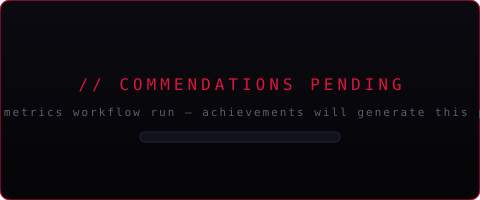
  

---

## ⬢ T R O P H Y · V A U L T — SELF-HOSTED

  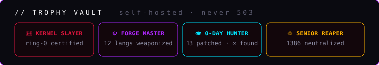

---

## ⬢ 3 D · C O N T R I B U T I O N · C I T Y

  
  

---

## ⬢ C O N T R I B U T I O N · S N A K E S

### 🩸 BLOOD SERPENT — the crimson hunter
  

### 💜 VOID SERPENT — the plasma phantom
  

---

## ⬢ C O N T R I B U T I O N · H U D

  
  
  
  
  
  
  

---

## ⬢ S Y S T E M · L O G &nbsp;·&nbsp; O P E R A T O R · V I T A L S

  
  

---

## ⬢ V I T A L S

  

---

## ⬢ E S T A B L I S H · C O N T A C T

> *"I don't write code. I forge weapons."*
> *"I speak from assembly to cloud — I don't miss a single layer."*
> *"Seniors terminated: 1337. Juniors spared: 0. You have been warned."*

<!-- ░░ FINAL HELLFIRE — the profile ends in flames ░░ -->

### ⚠️ YOU HAVE REACHED THE END. THE FIRE HASN'T. ⚠️

