

<!-- ░░ BREAKING NEWS TICKER — handcrafted animated SVG ░░ -->

<!-- ░░ CUSTOM GLITCH HEADER v3 — CRT flash + frame shake ░░ -->

<!-- ░░ DETONATION PROTOCOL ░░ -->

<!-- ░░ HAZARD STRIP ░░ -->

  

---

## ⬢ B O O T · S E Q U E N C E

  

---

## ⬢ T H R E A T · S W E E P &nbsp;·&nbsp; F U S I O N · C O R E &nbsp;·&nbsp; O P C O D E · R A I N

  <table><tr><td>
    
  </td><td>
    
  </td><td>
    
  </td></tr></table>

---

## ⬢ C O M B A T · R E C O R D

  

---

## ⬢ S Y S T E M · T E L E M E T R Y

  

> STATUS: weaponizing code since day zero — no layer untouched.

---

## ⬢ S T A C K · M A T R I X

### 🥷 LOW-LEVEL · THE BARE METAL

### ☁️ HIGH-LEVEL · THE INTERFACE

### 🗡 SYSTEMS · THE BATTLEFIELD

---

## ⬢ G I T H U B · C O M B A T · D A T A

  
  

  
  

---

## ⬢ I N T E L · S U M M A R Y · C A R D S

  
  
  
  
  

---

## ⬢ T R O P H Y · V A U L T

  

---

## ⬢ 3 D · C O N T R I B U T I O N · C I T Y

  <a href="https://skyline.github.com/hesam-oxe/2025">
    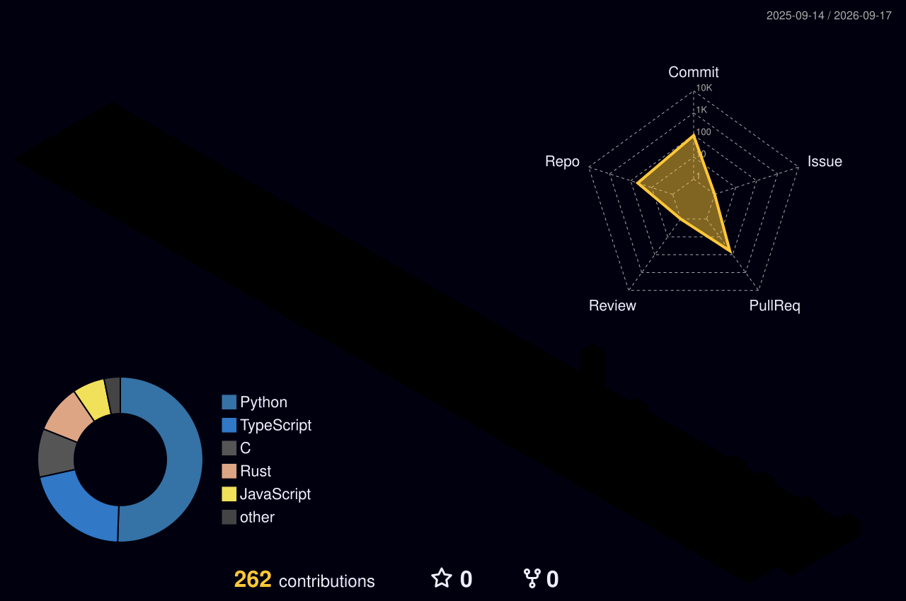
  </a>
  

---

## ⬢ C O N T R I B U T I O N · S N A K E

  
  

---

## ⬢ C O N T R I B U T I O N · H U D

  
  
  
  
  
  
  

---

## ⬢ V I T A L S

  

---

## ⬢ E S T A B L I S H · C O N T A C T

> *"I don't write code. I forge weapons."*
> *"I speak from assembly to cloud — I don't miss a single layer."*

### ⚠️ WARNING: OPERATING AT SYSTEM LEVEL ⚠️

