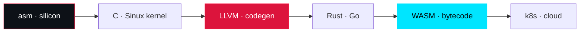

<div align="center">

<a href="https://github.com/hesam-oxe/hesam-oxe/actions"></a>
<a href="https://github.com/hesam-oxe/hesam-oxe/actions"></a>
<a href="https://github.com/hesam-oxe/hesam-oxe/actions"></a>
<a href="https://github.com/hesam-oxe?tab=followers"></a>
<a href="https://github.com/hesam-oxe/hesam-oxe"></a>

<p align="center">
  <a href="#-boot-sequence">BOOT</a> ·
  <a href="#-the-crash-i-fixed">CRASH</a> ·
  <a href="#-merge-board">MERGES</a> ·
  <a href="#-upstream-radar">RADAR</a> ·
  <a href="#-forge--six-stages-zero-dependencies">FORGE</a> ·
  <a href="#-verify-everything-yourself">VERIFY</a> ·
  <a href="#-boss-fight--catastrophic-backtracking">BOSS</a> ·
  <a href="#-establish-contact">CONTACT</a>
</p>


<picture>
  <source media="(prefers-color-scheme: light)" srcset="assets/glitch-name-light.svg"/>
  
</picture>


</div>

> [!IMPORTANT]
> **Everything on this page is falsifiable.** Every number was measured by execution, every
> patch links to a real diff, and the commands to reproduce all of it are [in this README](#-verify-everything-yourself).
> Nothing here is aspirational.


---

## ⬢ BOOT SEQUENCE

<div align="center">
  
</div>

---

## ⬢ THE CRASH I FIXED

Not a metaphor. LLVM's `CodeGenPrepare` asserts and dies when `tryUnmergingGEPsAcrossIndirectBr`
meets a `callbr` / `asm goto` with indirect successors. Here's the dump — and the patch.

<div align="center">
  
</div>

> **Patch:** [`llvm/llvm-project#201443`](https://github.com/llvm/llvm-project/pull/201443) — submitted upstream, under review.
> Companion: [`#201612`](https://github.com/llvm/llvm-project/pull/201612) — `[X86]` prevent NUW flag forwarding in the ADD→SUB peephole.


---

## ⬢ MERGE BOARD

Landed upstream. Not forked, not starred — **merged**.

<div align="center">
  
</div>

| Project | Contribution | PR |
|---|---|---|
| **OWASP** · Agent Memory Guard | GitHub Action — agent-memory vulnerability scanner | [#18](https://github.com/OWASP/www-project-agent-memory-guard/pull/18) |
| **OWASP** · Agent Memory Guard | LlamaIndex integration adapter | [#19](https://github.com/OWASP/www-project-agent-memory-guard/pull/19) |
| **OWASP** · Agent Memory Guard | CrewAI integration adapter | [#20](https://github.com/OWASP/www-project-agent-memory-guard/pull/20) |
| **OWASP** · Agent Memory Guard | Prometheus metrics exporter | [#21](https://github.com/OWASP/www-project-agent-memory-guard/pull/21) |
| **OWASP** · Agent Memory Guard | `Policy.tiered()` preset + memory-class taxonomy | [#23](https://github.com/OWASP/www-project-agent-memory-guard/pull/23) |
| **OWASP** · Agent Memory Guard | `source_type` provenance flag on `SecurityEvent` | [#24](https://github.com/OWASP/www-project-agent-memory-guard/pull/24) |
| **OWASP** · Agent Memory Guard | Multi-turn delayed-attack category in benchmark suite | [#42](https://github.com/OWASP/www-project-agent-memory-guard/pull/42) |
| **nexu-io** · open-design | Legacy `~/.fnm` path in toolchain resolution | [#1110](https://github.com/nexu-io/open-design/pull/1110) |
| **Authora** | OTP login hardening, legacy-code removal | [#3](https://github.com/Authorair/Authora/pull/3) |
| **HiveSofts** · hive-app | Backend refactor | [#37](https://github.com/HiveSofts/hive-app/pull/37) |
| **TaniCSS** · Tani | v2.0 framework upgrade + full documentation | [#1](https://github.com/TaniCSS/Tani/pull/1) · [#2](https://github.com/TaniCSS/Tani/pull/2) |
| **flappy-2048** | 9 bug fixes — save persistence in packaged builds, hitbox correctness | [#1](https://github.com/MY-Jafari/flappy-2048/pull/1) |

**Seven merged patches into one OWASP security project** — integration adapters, an
observability exporter, a CI scanner, and a threat-model extension to its benchmark suite.
A body of work in a single codebase, not a drive-by.

---

## ⬢ UPSTREAM RADAR

<div align="center">
  
</div>

Open PRs against projects where review cycles run in months. Listed because the **diffs are
public**, not because they landed.

| Project | Contribution | PR |
|---|---|---|
| **LLVM** | `[X86]` Prevent NUW flag forwarding in ADD→SUB peephole | [#201612](https://github.com/llvm/llvm-project/pull/201612) |
| **LLVM** | `[CodeGenPrepare]` Crash with `asm goto` / indirect branch | [#201443](https://github.com/llvm/llvm-project/pull/201443) |
| **Go** | `cmd/compile`: size cache in `StdSizes` — kills exponential compile time | [#79314](https://github.com/golang/go/issues/79314) |
| **Apache SeaTunnel** | Reuse shared `SinkWriter` for same destination in multi-table sink | [#11077](https://github.com/apache/seatunnel/pull/11077) |
| **Apache Gravitino** | `View` / `ViewCatalog` interfaces for the Python relational catalog | [#11019](https://github.com/apache/gravitino/pull/11019) |
| **Meta** · PyTorch tritonparse | Customizable labels in file-diff view | [#407](https://github.com/meta-pytorch/tritonparse/pull/407) |
| **Sphinx** | `source_language` config + `lang` attribute for untranslated text | [#14429](https://github.com/sphinx-doc/sphinx/pull/14429) |
| **Canonical** | Migrate documentation wordlist to Vale `accept.txt` | [#197](https://github.com/canonical/documentation-style-guide/pull/197) |
| **Academy Software Foundation** · rawtoaces | Prefer `std::filesystem` `error_code` over exceptions | [#295](https://github.com/AcademySoftwareFoundation/rawtoaces/pull/295) |
| **Lightning AI** · LitServe | Wait for worker setup completion in `wrap_litserve_start` | [#682](https://github.com/Lightning-AI/LitServe/pull/682) |
| **bilibili** · web-demuxer | Worker option for inline / main-thread runtime | [#53](https://github.com/bilibili/web-demuxer/pull/53) |
| **Telegram Desktop** | Screen-reader focus announcement for context menus | [#31198](https://github.com/telegramdesktop/tdesktop/pull/31198) |
| **Telegram Desktop** | Accessible-name fallback for UI buttons | [#31197](https://github.com/telegramdesktop/tdesktop/pull/31197) |

<details>
<summary><b>☠ Rejected patches — the ones that didn't make it</b></summary>

<br/>

Listed because a record with no failures in it isn't a record.

| Project | Contribution | PR |
|---|---|---|
| **Microsoft** · TypeScript | Error on private property access in generic intersection types | [#63548](https://github.com/microsoft/TypeScript/pull/63548) |
| **Microsoft** · typescript-go | Same fix, native port | [#4290](https://github.com/microsoft/typescript-go/pull/4290) |
| **Microsoft** · typescript-go | Propagate module bindings to augmentation body | [#4291](https://github.com/microsoft/typescript-go/pull/4291) |
| **NASA** · Worldview | Service Worker tile caching for GIBS tiles | [#6699](https://github.com/nasa-gibs/worldview/pull/6699) |
| **NASA** · Worldview | iOS Canvas memory leak on colormap threshold change | [#6698](https://github.com/nasa-gibs/worldview/pull/6698) |
| **Meta** · tritonparse | Migrate zstandard → Python 3.14 stdlib `zstd` | [#405](https://github.com/meta-pytorch/tritonparse/pull/405) |

</details>

<div align="center">
  
</div>

---

## ⬢ FORGE — SIX STAGES, ZERO DEPENDENCIES

<div align="center">
  
</div>

A statically typed language with a real type checker, a real optimizer, and a stack VM —
**568 lines, no libraries.** It runs live at [hesam-oxe.github.io](https://hesam-oxe.github.io).

| System | Implementation | Measured |
|---|---|---|
| **FORGE compiler** | Lexer → Pratt parser → AST → type checker → constant folding + DCE → bytecode → stack VM | `fib(20)` → `6765` in **218,913 VM steps** |
| **Optimizer** | Constant folding, algebraic identities, dead-branch and dead-loop elimination | **31 → 12** bytecode ops · 5 folds · 2 DCE |
| **Type checker** | Real inference and rejection, source-mapped carets | `let x: int = true` → `type mismatch: 'x' declared 'int' but initializer is 'bool'` |
| **WebAssembly** | Emitted **byte by byte** — hand-written LEB128, section headers, raw opcodes. No Emscripten, no `wat2wasm` | **253 bytes** · `validate()` → `true` · `fib(30)` → `832040` |
| **SHA-256** | Full FIPS 180-4: message schedule, 64 rounds, padding, big-endian length | All NIST vectors pass · **200/200** vs `node:crypto` |
| **Regex engine** | Recursive-descent parser → **Thompson NFA** → subset simulation with ε-closure | `(a\|a)*b` × 40 in **0.66 ms** |
| **Raytracer** | Analytic ray-sphere intersection, recursive reflection, Fresnel falloff, gamma correction | ~250k rays · ~2M rays/s |
| **N-body** | 200 bodies, 19,900 pair-forces/frame, **velocity-Verlet** symplectic integrator | Energy drift **0.0000%** |

<div align="center">
  
  
</div>

<div align="center">
  
</div>

---

## ⬢ VERIFY EVERYTHING YOURSELF

The whole point. Don't take a single number above on faith.

```bash
git clone https://github.com/hesam-oxe/hesam-oxe.github.io && cd hesam-oxe.github.io/engine

# 253-byte WebAssembly module, emitted by hand — validate and run it
node -e '
  const b = Buffer.from(require("fs").readFileSync("core.wasm.b64","utf8").trim(),"base64");
  console.log("bytes:", b.length, "valid:", WebAssembly.validate(b));
  console.log("fib(30) =", new WebAssembly.Instance(new WebAssembly.Module(b)).exports.fib(30));
'
# → bytes: 253  valid: true
# → fib(30) = 832040

# SHA-256 against Node's OpenSSL binding, 200 random inputs
node -e '
  const A = require("./forge.js"), c = require("crypto");
  let ok = 0;
  for (let i = 0; i < 200; i++) {
    const s = c.randomBytes(32).toString("hex");
    if (A.sha256(s) === c.createHash("sha256").update(s).digest("hex")) ok++;
  }
  console.log("match:", ok + "/200");
'
# → match: 200/200

# Compile and execute a program on the hand-written VM
node -e '
  const F = require("./compiler.js");
  const c = F.compile(`
    fn fib(n: int) -> int { if n < 2 { return n; } return fib(n-1) + fib(n-2); }
    fn main() -> int { print fib(20); return 0; }
  `);
  console.log(c.run());
'
# → { output: [ "6765" ], steps: 218913, result: 0 }
```

**If any of that fails on your machine, open an issue. I'd rather be corrected than believed.**

<div align="center">
  
</div>

---

## ⬢ BOSS FIGHT — CATASTROPHIC BACKTRACKING

<div align="center">
  
</div>

Linear time **by construction**, not by luck. Most production regex engines — PCRE, Python's
`re`, JavaScript's built-in — will hang on this input. Thompson's 1968 construction won't,
and there's a button on the site that fires the bomb and times it.

---

## ⬢ KILL CHAIN — SILICON TO CLOUD



<div align="center">
  
</div>

### Stack

<div align="center">

**BARE METAL**
<br/>


**INTERFACE**
<br/>


**BATTLEFIELD**
<br/>


</div>


---

## ⬢ SYSTEMS I'VE BUILT

<div align="center">
  
</div>

| Project | Stack | What it is |
|---|---|---|
| [**Sinux**](https://github.com/hesam-oxe/Sinux) | `C` · `asm` | Operating system kernel — boot, memory management, scheduling |
| [**Phobos**](https://github.com/hesam-oxe/Phobos) | `Rust` | Native IDE, AGPL-3.0. Turbo-Pascal ergonomics, modern toolchain |
| [**FORGE**](https://github.com/hesam-oxe/hesam-oxe.github.io) | `JavaScript` | Statically typed language, six-stage compiler, stack VM — 568 lines, zero dependencies |
| [**Tani**](https://github.com/hesam-oxe/Tani) | `CSS` | Zero-JS utility-first framework with a component library |
| [**salon**](https://github.com/hesam-oxe/salon) | `Rust` | — |
| [**apollo**](https://github.com/hesam-oxe/apollo) | `Python` | — |

<div align="center">
  
  
</div>

---

## ⬢ CLASSIFIED DOSSIERS

<details>
<summary><b>☠ FILE 001 — HOW A 253-BYTE WASM MODULE GETS WRITTEN BY HAND</b></summary>

<br/>

No toolchain. You write the bytes.

1. **Magic + version** — `00 61 73 6D 01 00 00 00`. Eight bytes before anything exists.
2. **Type section** (id `1`) — encode each signature as `60 <params> <results>`, lengths in LEB128.
3. **Function section** (id `3`) — map function index → type index.
4. **Export section** (id `7`) — name length, name bytes, kind, index. Every string is length-prefixed.
5. **Code section** (id `10`) — local declarations, then raw opcodes: `20 00` is `local.get 0`,
   `41` is `i32.const` followed by a *signed* LEB128, `6A` is `i32.add`, `0B` ends the body.
6. **Every section carries its own byte length** — which you only know after emitting it, so you
   emit into a buffer, measure, then prepend. Get one LEB128 continuation bit wrong and the whole
   module is rejected with no useful error.

Result: 253 bytes, four exports, and `WebAssembly.validate()` returns `true`.

</details>

<details>
<summary><b>🔥 FILE 002 — WHY THE OPTIMIZER ISN'T FAKE</b></summary>

<br/>

Toggle it off on the site and watch the numbers move:

```
optimize=false   bytecode=31   folds=0   dce=0   →  26
optimize=true    bytecode=12   folds=5   dce=2   →  26
```

Same answer, 61% fewer instructions. Constant folding collapses `2*3 + 4*5` at compile time,
algebraic identity erases `x*1 + 0`, and dead-branch elimination removes `if false { … }`
and `while false { … }` from the emitted bytecode entirely. The disassembler is right there
— read the listing before and after.

</details>

<details>
<summary><b>👁 FILE 003 — RULES OF ENGAGEMENT</b></summary>

<br/>

1. **No layer untouched.** Assembly to cloud, and I can defend any level of it in an interview.
2. **Every claim falsifiable.** If it can't be reproduced with a command, it doesn't go on this page.
3. **Failures are part of the record.** Six rejected patches are listed above, by name.
4. **No borrowed credit.** Forks aren't contributions. Stars aren't skill.

</details>

---

## ⬢ SYSTEM LOG · OPERATOR VITALS

<div align="center">
  
  
  
</div>

---

## ⬢ TROPHY VAULT

<div align="center">
  
  
  
</div>

---

## ⬢ TELEMETRY

### ⚡ RECENT ACTIVITY
<!-- ACTIVITY-START -->
- 🔥 `PushEvent` @ [hesam-oxe/hesam-oxe](https://github.com/hesam-oxe/hesam-oxe) — 2026-09-05
- 🔥 `PushEvent` @ [hesam-oxe/hesam-oxe.github.io](https://github.com/hesam-oxe/hesam-oxe.github.io) — 2026-09-07
- 🔥 `PushEvent` @ [hesam-oxe/hesam-oxe](https://github.com/hesam-oxe/hesam-oxe) — 2026-09-04
- 🔥 `PushEvent` @ [hesam-oxe/hesam-oxe.github.io](https://github.com/hesam-oxe/hesam-oxe.github.io) — 2026-09-06
- 🔥 `PushEvent` @ [hesam-oxe/hesam-oxe](https://github.com/hesam-oxe/hesam-oxe) — 2026-09-05
<!-- ACTIVITY-END -->

<div align="center">
  
  
  
</div>

### 🌃 3D CONTRIBUTION CITY

<div align="center">
  <a href="https://skyline.github.com/hesam-oxe/2025">
    
  </a>
</div>

### 🐍 CONTRIBUTION SERPENTS

<div align="center">
  
  
</div>

---

## ⬢ FORTRESS GATEWAY

<div align="center">
  <a href="https://hesam-oxe.github.io">
    
  </a>
</div>

> [!TIP]
> **The proof continues outside GitHub.** A compiler, a hand-emitted WASM module, a raytracer
> and SHA-256 — all executing in your browser at [hesam-oxe.github.io](https://hesam-oxe.github.io).
> No backend. No frameworks. Open DevTools and read the source.

---

## ⬢ ESTABLISH CONTACT

<div align="center">

> *"I don't list technologies. I ship the implementations."*
> *"Assembly to cloud — and I can defend every layer."*
> *"Every claim on this page is falsifiable. That's the point."*

[](https://github.com/hesam-oxe)
[](https://hesam-oxe.github.io)
[](https://www.linkedin.com/in/hesam-jamali-218b93414/)
[](mailto:chngyzkhanwhsht@gmail.com)


<sub>Every number on this page was measured, not estimated. The commands to reproduce them are above.</sub>

</div>


